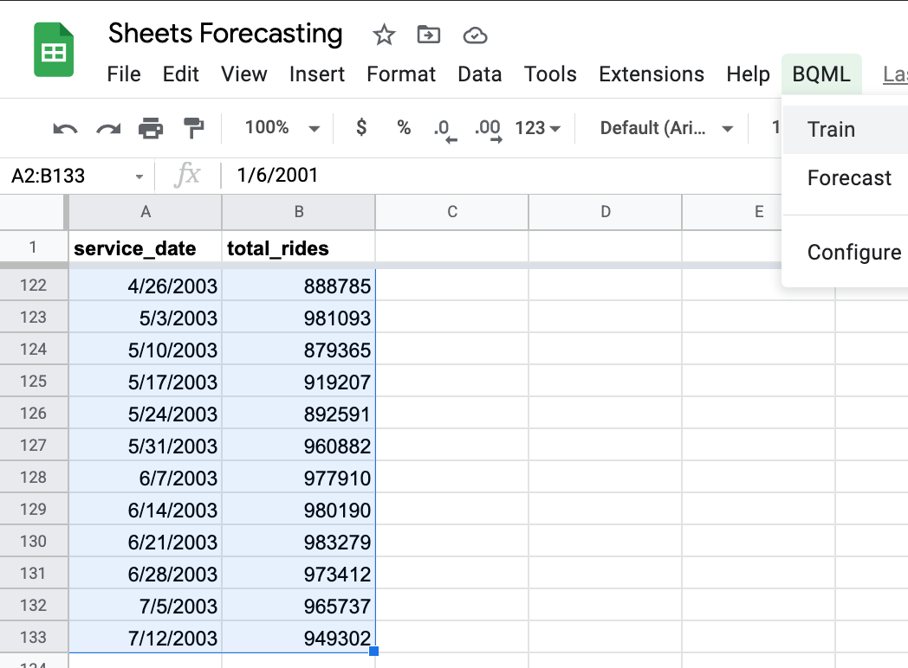
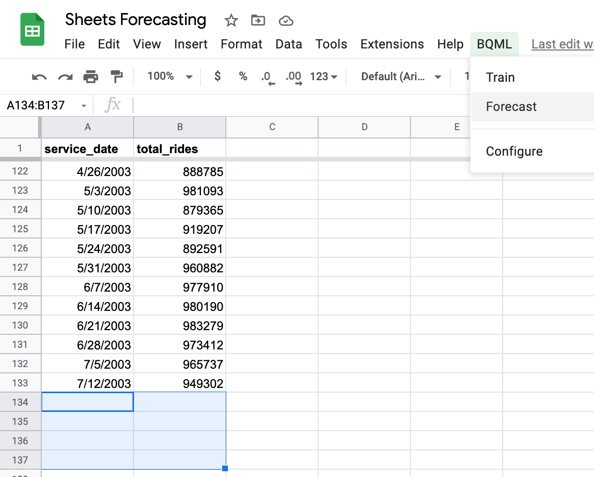

# BQML Forecasting with Sheets

This code sample shows how to use time-series forecasting models in [BigQuery Machine Learning](https://cloud.google.com/bigquery-ml/docs/introduction?utm_campaign=CDR_kwe_aiml_time-series-forecasting_011521&utm_source=external&utm_medium=web) directly from Sheets.

## Usage

1. Select data you'd like to use to train your model, and choose **BQML > Train** from the menu.

Your data must be formatted with 2 columns, the first containing the date and/or time, and the second with the numeric value to forecast.



2. When the training is finished, select the number of time steps you'd like to forecast, and choose **BQML > Forecast** from the menu. The script will populate the range. If no range is selected, it will prompt you for the number of time steps.



## Getting started

1. Load an existing Google Sheet, or add data to a new Google Sheet (as easy as typing [sheet.new](sheet.new) in your browser).
2. From your spreadsheet, choose **Extensions > Apps Script**.
3. From the **Project Settings** in the left panel, check the box to "Show 'appsscript.json' manifest file in editor." 
4. Paste in the contents of `code.gs` from this repo into the Apps Script project.
5. Paste in the contents of `appsscript.json` from this repo into the Apps Script project.


6. Save both files, and close the Apps Script window.
7. The first time you train a model, it will prompt you for your GCP project ID. It will use a default BigQuery dataset ID of `sheets_forecast` that you can optionally override in the **BQML > Configure** menu.

## How it works

### Training

First, the script will extract rows from the selected range and insert them into a temporary table in [BigQuery](https://cloud.google.com/bigquery?utm_campaign=CDR_kwe_aiml_time-series-forecasting_011521&utm_source=external&utm_medium=web).

Then, the script runs a BQML query to create an ARIMA [time series model](https://cloud.google.com/bigquery-ml/docs/reference/standard-sql/bigqueryml-syntax-create-time-series?utm_campaign=CDR_kwe_aiml_time-series-forecasting_011521&utm_source=external&utm_medium=web) that looks something like this:

```sql
CREATE OR REPLACE MODEL
  `sheets_forecast.sheets_forecast_model` OPTIONS( MODEL_TYPE='ARIMA',
    TIME_SERIES_TIMESTAMP_COL='datetime',
    TIME_SERIES_DATA_COL='data') AS
SELECT
  *
FROM
  `sheets_forecast.sheets_forecast_training_data`
```

The query can be further customized with other options, such as including holidays into the model.

### Forecasting

To make a forecast, the script sets the `horizon` parameter in the BQML forecast query to the number of rows selected in the sheet. Two fields are extracted from the forecast: the datetime formatted as a string with the date, time, and time zone; and the forecasted value for that datetime. The query looks like this (assuming 3 rows are selected):

```sql
SELECT
  FORMAT_TIMESTAMP("%FT%T%Ez", forecast_timestamp),
  forecast_value
FROM
  ML.FORECAST(MODEL `sheets_forecast.sheets_forecast_model`,
    STRUCT(3 AS horizon))
```

The selected range is then updated with the values returned from the query.
